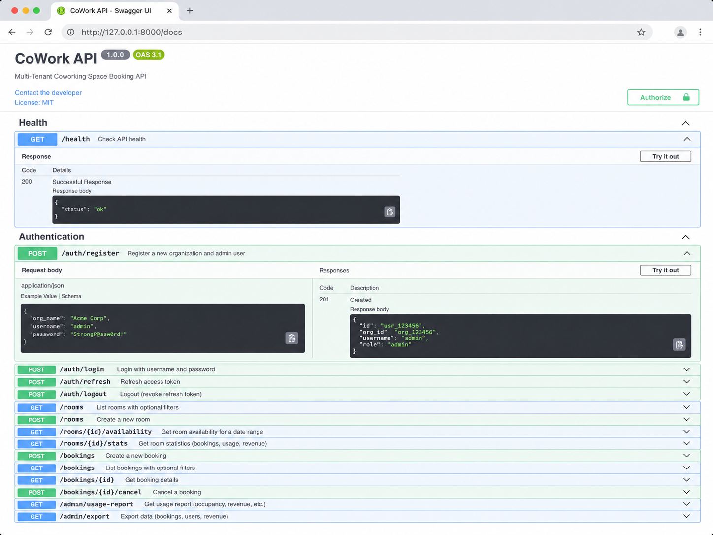
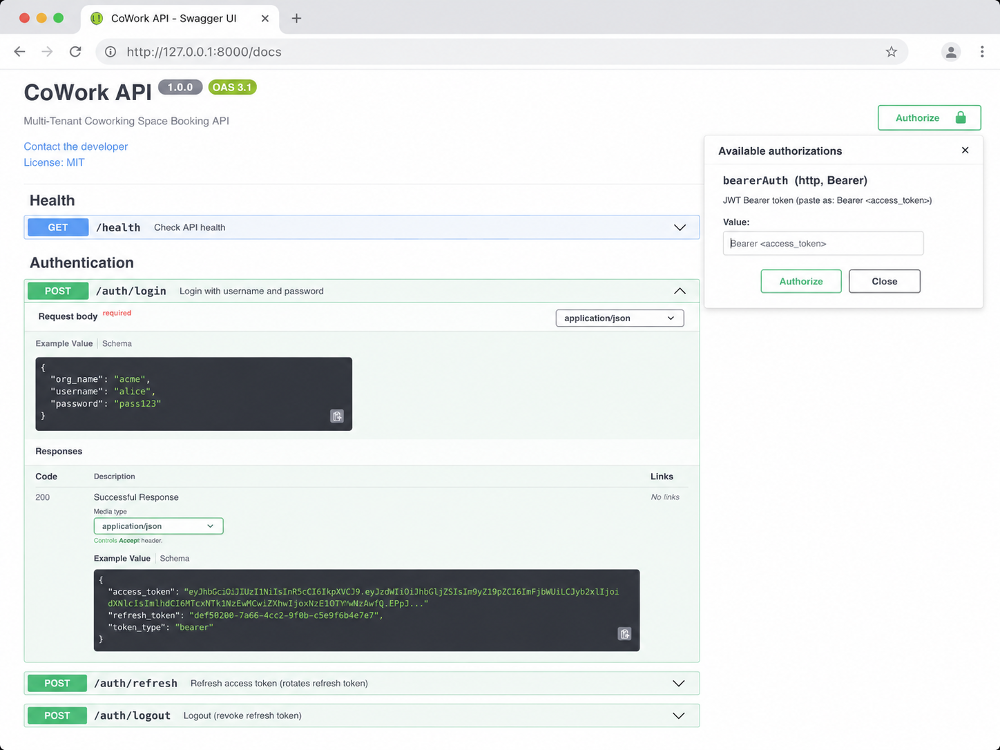
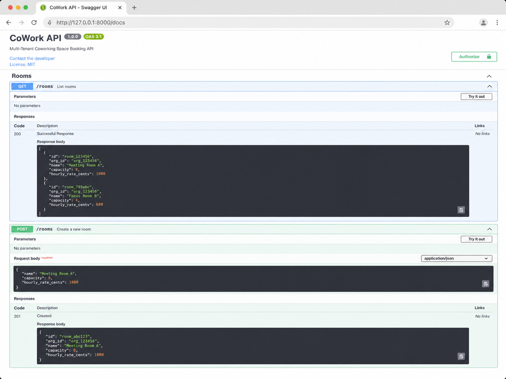
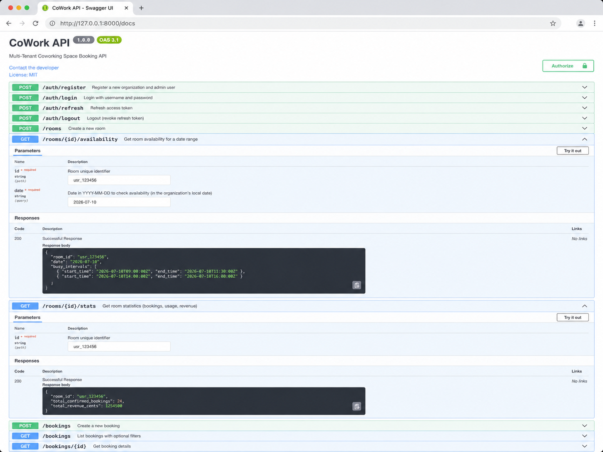
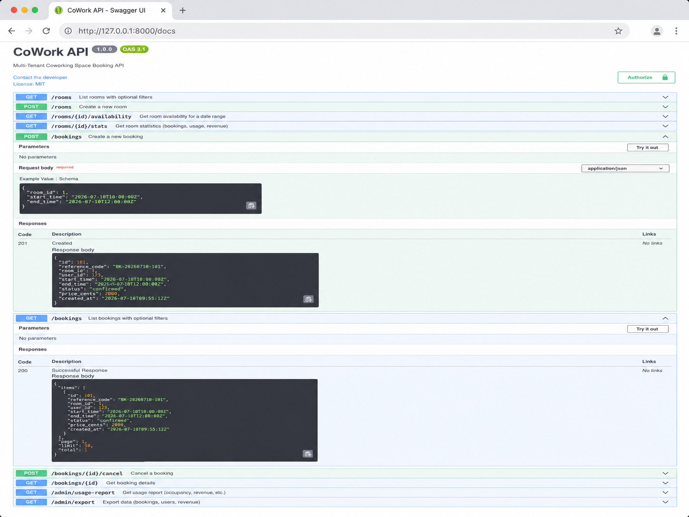
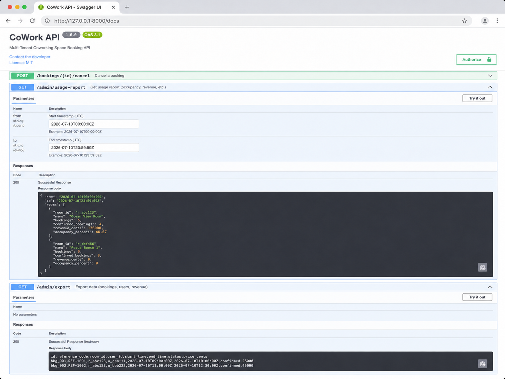

# CoWork API — Multi-Tenant Coworking Space Booking System

[](https://www.python.org/)
[](https://fastapi.tiangolo.com/)
[](https://swagger.io/specification/)
[](LICENSE)

**CoWork API** is a clean, fixed, and GitHub-ready FastAPI project for managing coworking-space room bookings in a multi-tenant environment. It supports organization registration, JWT authentication, room management, availability checking, booking operations, cancellation, admin reporting, and data export.

This project was prepared for the **IUT 12th ICT Fest Bdapps Agentic AI Hackathon — Preliminary Round** bug-fix challenge.

---

## Table of Contents

- [Project Overview](#project-overview)
- [Key Features](#key-features)
- [Tech Stack](#tech-stack)
- [API Endpoints](#api-endpoints)
- [Input/Output Screenshots](#inputoutput-screenshots)
- [Getting Started](#getting-started)
- [Run with Docker](#run-with-docker)
- [Swagger Testing Workflow](#swagger-testing-workflow)
- [Example Request Bodies](#example-request-bodies)
- [Project Structure](#project-structure)
- [Hackathon Metadata](#hackathon-metadata)
- [License](#license)

---

## Project Overview

Coworking spaces usually serve multiple organizations, teams, and users at the same time. A reliable booking API must prevent time conflicts, separate tenant data, calculate usage, and provide clear administrative reports.

This API solves that problem by providing a backend service where each organization can:

- register an admin account,
- authenticate securely with JWT tokens,
- create and manage rooms,
- check room availability for a specific date,
- create and cancel bookings,
- view booking details,
- generate room usage and revenue reports,
- export operational booking data.

---

## Key Features

- **Multi-tenant organization support** — data is separated by organization.
- **JWT-based authentication** — login returns access and refresh tokens.
- **Room management** — create and list rooms with capacity and hourly rate.
- **Availability checking** — view available slots for a room on a given date.
- **Booking system** — create, list, view, and cancel bookings.
- **Conflict-safe booking flow** — designed to prevent overlapping bookings.
- **Admin reporting** — view occupancy, bookings, and revenue per room.
- **CSV export endpoint** — export booking and revenue data.
- **Interactive Swagger UI** — test every endpoint from the browser.
- **Docker support** — run the project with Docker Compose.

---

## Tech Stack

| Layer | Technology |
|---|---|
| Backend Framework | FastAPI |
| API Documentation | Swagger UI / OpenAPI 3.1 |
| ORM | SQLAlchemy |
| Validation | Pydantic |
| Authentication | JWT Bearer Token |
| Server | Uvicorn |
| Containerization | Docker / Docker Compose |

---

## API Endpoints

### Health

| Method | Endpoint | Description |
|---|---|---|
| `GET` | `/health` | Check API health status |

### Authentication

| Method | Endpoint | Description |
|---|---|---|
| `POST` | `/auth/register` | Register a new organization and admin user |
| `POST` | `/auth/login` | Login with organization name, username, and password |
| `POST` | `/auth/refresh` | Refresh access token |
| `POST` | `/auth/logout` | Revoke refresh token / logout |

### Rooms

| Method | Endpoint | Description |
|---|---|---|
| `GET` | `/rooms` | List rooms with optional filters |
| `POST` | `/rooms` | Create a new room |
| `GET` | `/rooms/{id}/availability` | Get room availability for a date range / date |
| `GET` | `/rooms/{id}/stats` | Get room statistics such as bookings, usage, and revenue |

### Bookings

| Method | Endpoint | Description |
|---|---|---|
| `POST` | `/bookings` | Create a new booking |
| `GET` | `/bookings` | List bookings with optional filters |
| `GET` | `/bookings/{id}` | Get booking details |
| `POST` | `/bookings/{id}/cancel` | Cancel a booking |

### Admin

| Method | Endpoint | Description |
|---|---|---|
| `GET` | `/admin/usage-report` | Get usage report with occupancy, revenue, and booking count |
| `GET` | `/admin/export` | Export booking, user, and revenue data as CSV/text |

---

## Input/Output Screenshots

The following screenshots show the API running successfully in Swagger UI at `http://127.0.0.1:8000/docs`.

### 1. Health Check and Registration

The API health endpoint returns a successful response, and the registration endpoint creates a new organization with an admin user.



---

### 2. Login and JWT Authorization

The login endpoint returns an access token, refresh token, and token type. The access token is used in the Swagger **Authorize** modal as a Bearer token.

> Security note: never commit real production tokens or passwords. The screenshot uses local testing data only.



---

### 3. Room Listing and Room Creation

The room endpoints return room details such as room ID, organization ID, room name, capacity, and hourly rate.



---

### 4. Room Availability and Room Statistics

The availability endpoint shows free time slots for a selected room and date. The stats endpoint shows confirmed bookings and total revenue.



---

### 5. Booking Creation and Booking List

The booking endpoint creates a confirmed booking with start time, end time, status, price, and reference code. The list endpoint returns paginated booking data.



---

### 6. Admin Usage Report and Export

The admin report endpoint returns room-level usage, confirmed booking count, occupancy percentage, and revenue. The export endpoint returns booking data in a CSV-like format.



---

## Getting Started

### Prerequisites

- Python **3.12+** recommended
- `pip`
- Git
- Optional: Docker and Docker Compose

### 1. Clone the Repository

```bash
git clone <your-repository-url>
cd <your-project-folder>
```

### 2. Create and Activate a Virtual Environment

#### Windows PowerShell

```bash
python -m venv .venv
.venv\Scripts\activate
```

#### macOS / Linux

```bash
python3 -m venv .venv
source .venv/bin/activate
```

### 3. Install Dependencies

```bash
python -m pip install --upgrade pip setuptools wheel
python -m pip install -r requirements.txt
```

> If `pydantic-core` fails to build on Windows, install Visual Studio Build Tools with the C++ toolchain, or use Python 3.12.

### 4. Run the API

```bash
uvicorn app.main:app --reload
```

### 5. Open Swagger UI

```text
http://127.0.0.1:8000/docs
```

### 6. Health Check

```bash
curl http://127.0.0.1:8000/health
```

Expected response:

```json
{
  "status": "ok"
}
```

---

## Run with Docker

```bash
docker compose up --build
```

Then open:

```text
http://127.0.0.1:8000/docs
```

To stop the containers:

```bash
docker compose down
```

---

## Swagger Testing Workflow

Use the following order while testing the API in Swagger UI:

1. Run `GET /health` to confirm the API is running.
2. Run `POST /auth/register` to create an organization and admin user.
3. Run `POST /auth/login` to receive an access token.
4. Click **Authorize** and paste the token in this format:

```text
Bearer <access_token>
```

5. Run `POST /rooms` to create a room.
6. Run `GET /rooms` to confirm the room exists.
7. Run `GET /rooms/{id}/availability` to check available slots.
8. Run `POST /bookings` to create a booking.
9. Run `GET /bookings` or `GET /bookings/{id}` to verify booking details.
10. Run `POST /bookings/{id}/cancel` to cancel a booking if needed.
11. Run `GET /admin/usage-report` to view occupancy and revenue.
12. Run `GET /admin/export` to export booking data.

---

## Example Request Bodies

### Register Organization

```json
{
  "org_name": "Acme Corp",
  "username": "admin",
  "password": "StrongP@ssw0rd!"
}
```

### Login

```json
{
  "org_name": "acme",
  "username": "admin",
  "password": "StrongP@ssw0rd!"
}
```

### Create Room

```json
{
  "name": "Meeting Room A",
  "capacity": 8,
  "hourly_rate_cents": 1000
}
```

### Create Booking

```json
{
  "room_id": 1,
  "start_time": "2026-07-10T10:00:00Z",
  "end_time": "2026-07-10T12:00:00Z"
}
```

### Usage Report Query Example

```text
GET /admin/usage-report?from=2026-07-10T00:00:00Z&to=2026-07-10T23:59:59Z
```

---

## Project Structure

```text
.
├── app/
│   ├── main.py              # FastAPI application entry point
│   ├── database.py          # Database engine, session, and base configuration
│   ├── models.py            # SQLAlchemy models
│   ├── schemas.py           # Pydantic request/response schemas
│   ├── auth.py              # Password hashing, JWT creation, and auth dependencies
│   └── ...
├── docs/
│   └── screenshots/         # Swagger input/output screenshots used in README
├── requirements.txt         # Python dependencies
├── docker-compose.yml       # Docker Compose configuration
├── Dockerfile               # Docker image definition
└── README.md                # Project documentation
```

> The exact file list may vary slightly depending on your final submission folder.

---

## Hackathon Metadata

| Field | Information |
|---|---|
| Event | IUT 12th ICT Fest Bdapps Agentic AI Hackathon — Preliminary Round |
| Project | CoWork API — Multi-Tenant Coworking Space Booking API |
| Team Name | Ek_Bar_Dhokha_Kha_Chuka_Hun_Dobara_Nahi_Khaunga |
| Team Lead | Munshi Nahiyan Amin |
| Institution | University of Liberal Arts Bangladesh (ULAB) |
| Registration Code | 02-50670 |

---

## License

This project is licensed under the **MIT License**.
